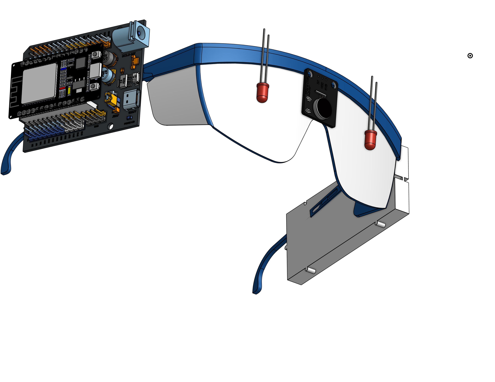
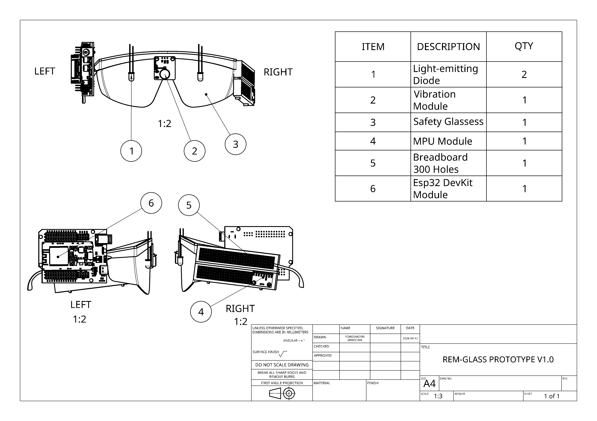
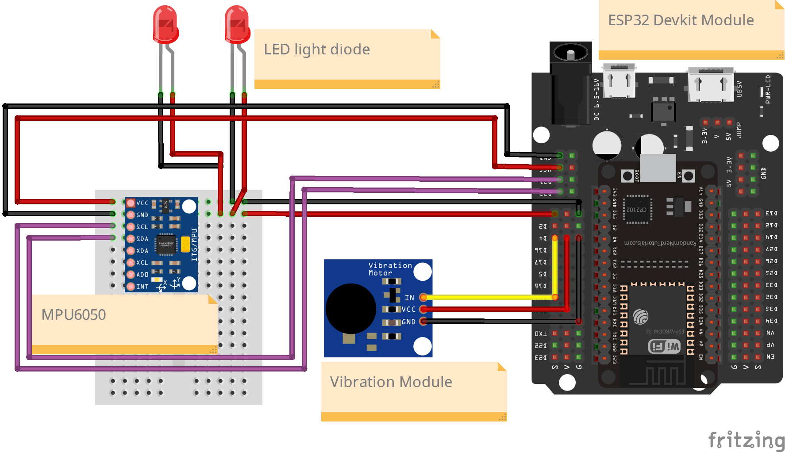
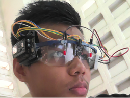

# 🕶️ REM-Glasses Prototype V1.0

> **Maximize your chances of lucid dreaming with intelligent sleep tracking.**

<p align="center">
  
</p>

<p align="center">
  
  
  
  
</p>

---

## 📖 1. About The Project

**REM-Glasses Prototype V1.0** is a smart eyewear device designed to assist in **Lucid Dreaming (becoming aware that you are dreaming)**.

The glasses track sleep patterns through head movement using a 6-axis accelerometer/gyroscope (IMU) combined with a sleep cycle simulation algorithm. When the system detects that the user has entered **REM Sleep**, it delivers subtle cue signals (soft flashing LED lights and gentle vibration alerts) to prompt conscious awareness within the dream without waking the user up.

---

## 🛠️ 2. Hardware & Components

<p align="center">
  
</p>

| Component | Description / Function |
| :--- | :--- |
| **ESP32 Development Board** | Main microcontroller, data processing |
| **MPU-6500 / MPU-6050 (IMU)** | 6-axis motion and accelerometer sensor (I2C) |
| **REM Cue Actuators (LED / Vibration Motor)** | Soft flashing LED light and vibration motor for REM alerts |
| **Safety Glasses (Just Prototype *\_*)** | Glasses or eye mask frame for mounting the sensor and board to the face |
| **Wiring & Accessories** | Jumper Wires, Breadboard |

---

## 🔌 3. Circuit & Wiring

<p align="center">
  
</p>

### Pin Mapping

| Device / Module | Pin | ESP32 Pin (GPIO) | Notes |
| :--- | :--- | :--- | :--- |
| **MPU-6500 (IMU)** | VCC | `3.3V` or `5V` | Sensor power supply |
| | GND | `GND` | Common Ground |
| | SCL | `GPIO 22` (D22) | I2C Clock |
| | SDA | `GPIO 21` (D21) | I2C Data |
| **REM Output 1** | Positive (+) | `GPIO 4` (D4) | REM Cue Alert 1 |
| **REM Output 2** | Positive (+) | `GPIO 15` (D15) | REM Cue Alert 2 & Calibration Status LED |
| **Built-in LED** | - | `GPIO 2` (D2) | On-board Calibration Indicator LED |

---

## 🔄 4. System Flowchart

```text
               +----------------------------------+
               |           Start / Boot           |
               +----------------------------------+
                                |
                                v
               +----------------------------------+
               |     Initialize Serial & I2C      |
               |       (SDA: D21, SCL: D22)       |
               +----------------------------------+
                                |
                                v
               +----------------------------------+
               |     MPU6500 Auto-Calibration    |
               |  (Keep still, 2000 samples)      |
               +----------------------------------+
                                |
                        [Calibrated OK?]
                         /            \
                   (Yes)/              \(No)
                       v                v
        +-----------------------+   +-----------------------+
        | Set Offsets & Ready   |   | D4/D2 Error Pulse     |
        | State = STATE_AWAKE   |   | & Auto Retry          |
        +-----------------------+   +-----------------------+
                    |                            ^
                    +----------------------------+
                    |
                    v
    ================= MAIN LOOP =================
                    |
      +-------------+-------------+
      |                           |
      v                           v
+------------------+     +-------------------------------+
|  Serial Commands |     | Every 100 ms:                 |
|  (!VERBOSE,      |     | - Read Accel magnitude        |
|   !TEST,         |     | - motion = |mag - 1.0G|       |
|   !DEBUG,        |     | - epochMotionScore += motion  |
|   !CALIBRATE)    |     +-------------------------------+
+------------------+                      |
                                          v
                         +-------------------------------+
                         | Every 60s (1 Epoch):          |
                         | Evaluate Sleep State Machine  |
                         +-------------------------------+
                                          |
                         +-------------------------------+
                         | epochMotionScore < T_STILL ?  |
                         +-------------------------------+
                                  /             \
                            (Yes)/               \(No)
                                v                 v
                 continuousStillEpochs++    continuousStillEpochs = 0
                                |                 |
                                +--------+--------+
                                         |
                                         v
                         +-------------------------------+
                         |         Current State         |
                         +-------------------------------+
                                   /           \
                       (STATE_AWAKE)           (STATE_SLEEPING_NREM)
                             /                       \
             +--------------+                         +----------------------+
             |                                                               |
             v                                                               v
+-----------------------------+                             +---------------------------------+
| continuousStillEpochs >= 15 |                             | minutesSinceSleep++             |
+-----------------------------+                             +---------------------------------+
        /              \                                                     |
  (Yes)/                \(No)                               +---------------------------------+
      v                  v                                  | Check REM Sleep Window:         |
[STATE_SLEEPING_NREM] [STATE_AWAKE]                         | Cycle 1: 80-100 min             |
                                                            | Cycle 2: 170-200 min            |
                                                            | Cycle 3: 255-295 min            |
                                                            | Cycle 4+: >= 340 min            |
                                                            +---------------------------------+
                                                                             |
                                                            +---------------------------------+
                                                            | In REM Window AND Still >= 5m ? |
                                                            +---------------------------------+
                                                                      /             \
                                                                (Yes)/               \(No)
                                                                    v                 v
                                                          [STATE_POSSIBLE_REM]   [STATE_SLEEPING]
                                                                    |
                                                                    v
                                                     +-------------------------------+
                                                     | Trigger REM Cue:              |
                                                     | D4 & D15 HIGH for 2 seconds   |
                                                     +-------------------------------+
```

---

## 💤 5. Quick Start Guide

<p align="center">
  
</p>

1. **Powering On & Calibration**
   - Connect power to the ESP32 board.
   - Put on the glasses and lie still for the initial startup. The system will calibrate the sensor while the LED blinks.
   - Once calibration is complete, the system automatically begins the sleep tracking mode.

2. **Serial Monitor Control Commands (Baud Rate: 115200)**
   - `!TEST` : Test-trigger the REM cue alert (active for 2 seconds)
   - `!DEBUG` : Toggle fast simulation mode (5-second epochs for quick testing)
   - `!VERBOSE` : Toggle detailed calculation and logging output
   - `!CALIBRATE` : Re-trigger the sensor calibration routine

3. **Sleep Operation**
   - After lying still continuously for 15 minutes, the system marks the state as **Sleep Onset**.
   - When reaching the natural **REM Sleep** cycle windows (Minutes 80–100, 170–200, 255–295, 340+) and the head remains still, the system triggers a 2-second REM Cue alert.

